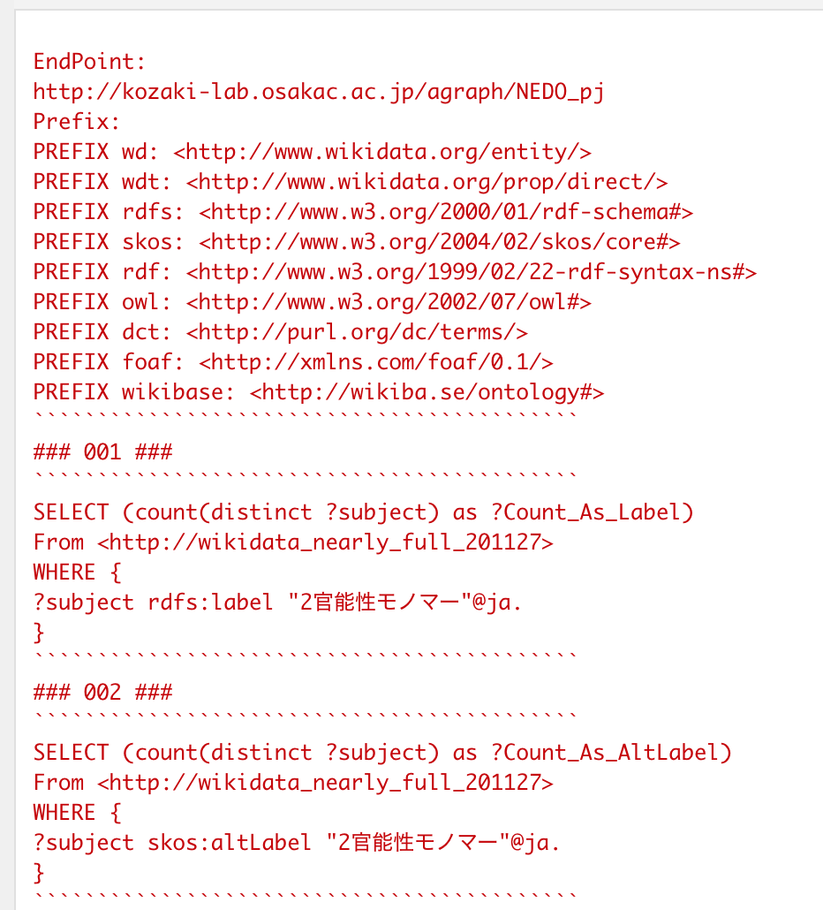
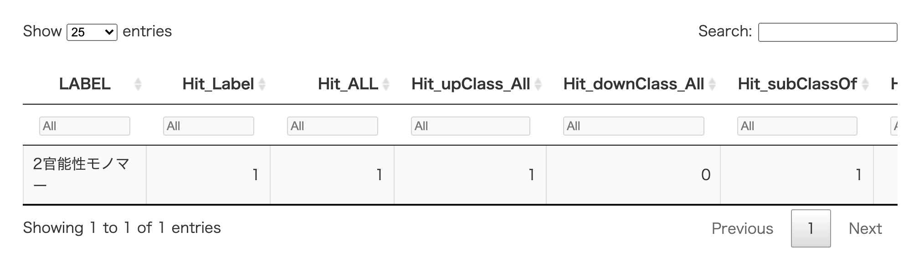

# agGraphSearch (under development)

## Intoduction

agGraphSearch, a R package, supply functions for searching graph data 
structures of RDF (Resource Description Framework) via SPARQL query.

This set of functions allows us to explore the graph data (triples) 
as a function of R, without having to create any SPARQL queries on R scripts.

## Installation

1. Start R.app

2. Run the following commands in the R console.

```{R}
install.packages( "devtools" )
devtools::install_github( "kumeS/agGraphSearch" )
library( "agGraphSearch" )
```

An alternative way,

```{R}
system( "git clone https://github.com/kumeS/agGraphSearch.git" )
system( "R CMD INSTALL agGraphSearch" )
library( "agGraphSearch" )
```

## Examples of function execution in the package

- CkeckQuery_agCount_Label_Num_Wikidata_P279_P31



- agCount_Label_Num_Wikidata_P279_P31



## Representative SPARQL endpoints 

- KzLab at OECU
  - Wikidata
    - Endpoint URL: http://kozaki-lab.osakac.ac.jp/agraph/NEDO_pj
    - Graph ID: http://wikidata_nearly_full_201127

  - Polymer ontology 1.1
    - Endpoint URL: http://kozaki-lab.osakac.ac.jp/agraph/NEDO_pj_11

  - DBpedia Japanese 2016
    - Endpoint URL: http://kozaki-lab.osakac.ac.jp/agraph/DBpedia2016_RDF
    - Graph ID: http://DBpedia_2016_jpn

  - IOBC / Mesh / LSD / Nikkaji / ICD10
    - Endpoint URL: http://kozaki-lab.osakac.ac.jp/agraph/IOBC_Mesh_LOD
		- Graph ID:
		  - http://iobc
		  - http://mesh
		  - http://lsd
		  - http://nikkaji
		  - http://icd10

## Author / maintainer

- Satoshi Kume

## License

Copyright (c) 2021 Satoshi Kume released under the [Artistic License 2.0](http://www.perlfoundation.org/artistic_license_2_0).

