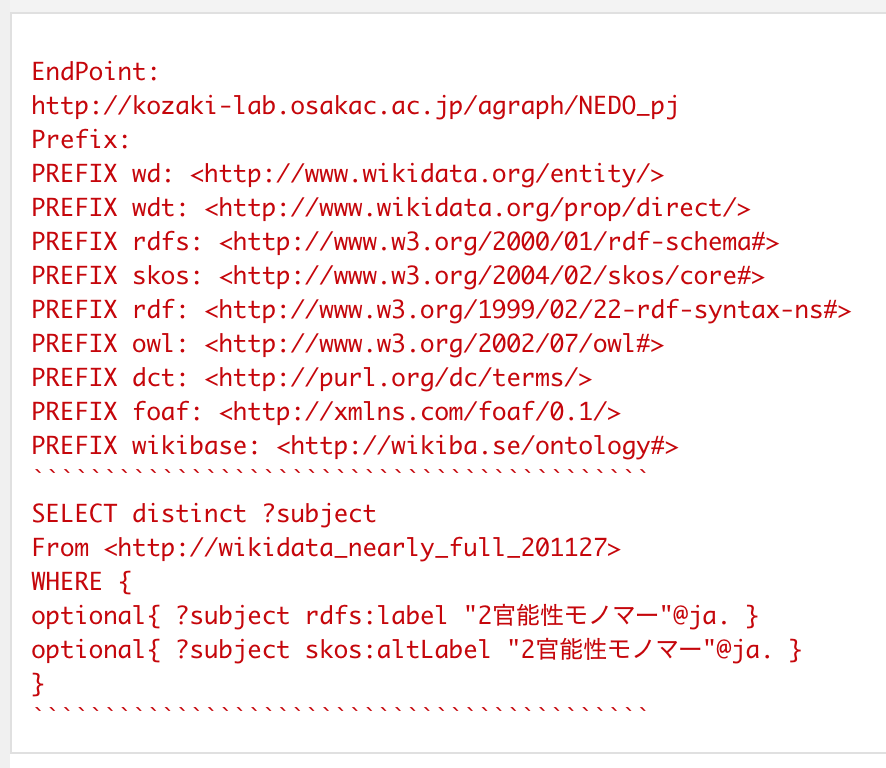
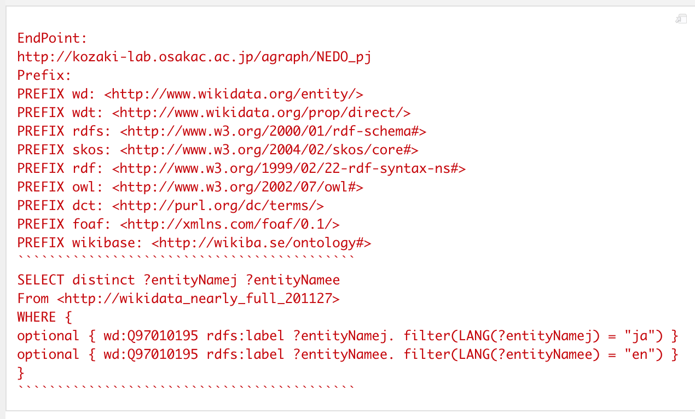
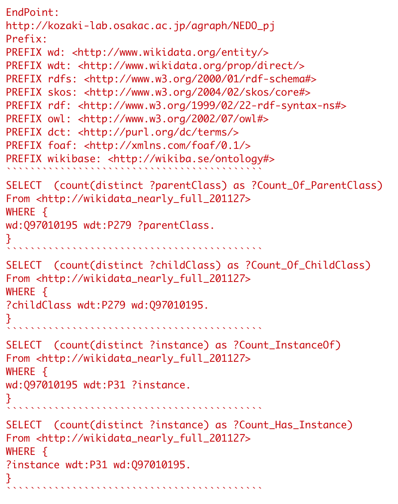

# agGraphSearch (ver 0.99.x)

## Introduction

agGraphSearch package supplies a tool-set for searching graph structures based on RDF (Resource Description Framework)
and extracting the subset of the class-related hierarchy with domain specific terms.

This set of functions also allows us to explore the triple-like formatted dataset 
without creating any SPARQL queries on R scripts.

See [the workflow submitted to IJCKG2021](https://kumes.github.io/agGraphSearch/vignettes/agGraphSearch-Wikidata-WF.html)

## Installation

1. Start R.app

2. Run the following commands in the R console.

```r
install.packages( "devtools" )
devtools::install_github( "kumeS/agGraphSearch" )
library( "agGraphSearch" )
```

An alternative way, type the code below in the R console window if you install Git command.

```r
system( "git clone https://github.com/kumeS/agGraphSearch.git" )
system( "R CMD INSTALL agGraphSearch" )
library( "agGraphSearch" )
```


## Tutorial/workflow

- [Installation](https://kumes.github.io/agGraphSearch/vignettes/agGraphSearch-installation.html)

- [Installation (Japanese)](http://translate.google.com/translate?hl=&sl=en&tl=ja&u=https%3A%2F%2Fkumes.github.io%2FagGraphSearch%2Fvignettes%2FagGraphSearch-installation.html)

- [A short-tutorial for agGraphSearch](https://kumes.github.io/agGraphSearch/vignettes/agGraphSearch-short-tutorial.html)

- [A Japanese short-tutorial for agGraphSearch](http://translate.google.com/translate?hl=&sl=en&tl=ja&u=https%3A%2F%2Fkumes.github.io%2FagGraphSearch%2Fvignettes%2FagGraphSearch-short-tutorial.html)

- [[Wikidata] agGraphSearch tutorial: A workflow to use agGraphSearch and Wikidata with PolyInfo terms](https://kumes.github.io/agGraphSearch/vignettes/agGraphSearch-Wikidata-WF.html)
  - Data Dump: [Google Drive](https://drive.google.com/drive/folders/1nk9nubKnX1uzcBf3GmdaijdGeqDoHucz?usp=sharing)
  - [Pre-processing of Dump Data](https://github.com/kumeS/AHLodDbs)
  
- [[Mesh] agGraphSearch tutorial: A workflow to use agGraphSearch and Mesh RDF with PolyInfo terms](https://kumes.github.io/agGraphSearch/vignettes/agGraphSearch-Mesh-WF-PolyInfo.html)
  - Data Dump: [Google Drive](https://drive.google.com/drive/folders/1qMSSfQ5maJsXj0FcDGhc5gnThMobpSSY?usp=sharing)
  - [Pre-processing of Dump Data](https://github.com/kumeS/AHLodDbs)

- [The workflow submitted to IJCKG2021 (The 10th International Joint Conference on Knowledge Graphs)](https://kumes.github.io/agGraphSearch/vignettes/agGraphSearch-Wikidata-WF.html)

## Some examples of function execution in the package

- CkeckQuery_agCount_Label_Num_Wikidata_P279_P31


- agCount_Label_Num_Wikidata_P279_P31 & agTableDT


- CkeckQuery_agWD_Alt_Wikidata



- CkeckQuery_agQIDtoLabel_Wikidata



- CkeckQuery_agCount_ID_Num_Wikidata_QID_P279_P31



## SPARQL endpoints 

- KzLab at OECU
  - Wikidata
    - Endpoint URL: http://kozaki-lab.osakac.ac.jp/agraph/NEDO_pj
    - Graph ID: http://wikidata_nearly_full_201127

  - Polymer ontology 1.1
    - Endpoint URL: http://kozaki-lab.osakac.ac.jp/agraph/NEDO_pj_11

  - DBpedia Japanese 2016
    - Endpoint URL: http://kozaki-lab.osakac.ac.jp/agraph/DBpedia2016_RDF
    - Graph ID: http://DBpedia_2016_jpn

  - IOBC / Mesh / LSD / Nikkaji / ICD10
    - Endpoint URL: http://kozaki-lab.osakac.ac.jp/agraph/IOBC_Mesh_LOD
		- Graph ID:
		  - http://iobc
		  - http://mesh
		  - http://lsd
		  - http://nikkaji
		  - http://icd10

## Optional setting at OECU

Run the following commands in the R console.

```r
#Proxy setting at OECU
proxy_url = "http://wwwproxy.osakac.ac.jp:8080"
Sys.setenv("http_proxy" = proxy_url)
Sys.setenv("https_proxy" = proxy_url)
Sys.setenv("ftp_proxy" = proxy_url)

#Test 1
curlGetHeaders("http://www.google.com/")
# OK if the optput is 200
install.packages("readr")
# OK if it is installed successfully.

#Test 2
install.packages("BiocManager")
BiocManager::install("BiocStyle")
install.packages( "devtools" )
devtools::install_github( "kumeS/agGraphSearch" )
library( "agGraphSearch" )

#Test 3
#system( "git clone https://github.com/kumeS/agGraphSearch.git" )
```

## Author / maintainer

- Satoshi Kume

## License

[Artistic License 2.0](http://www.perlfoundation.org/artistic_license_2_0).

